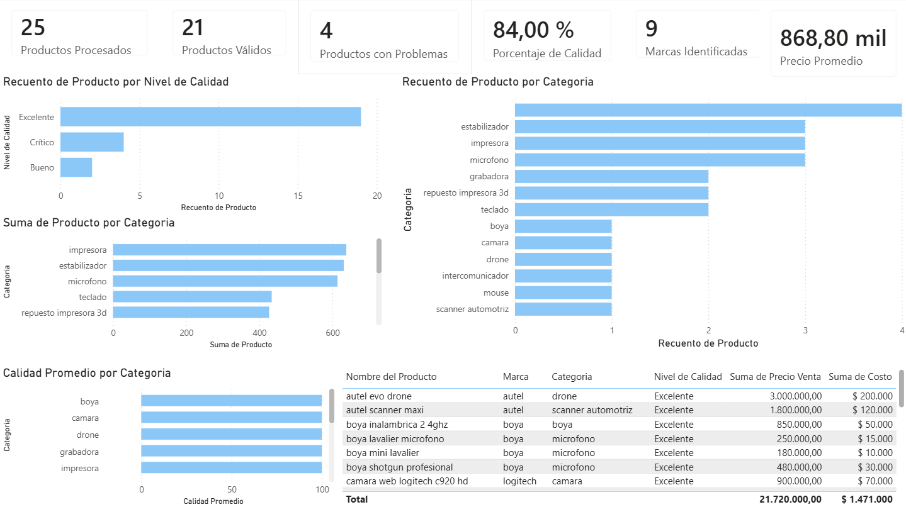

# Pipeline de Automatización para Catálogo eCommerce

Pipeline desarrollado en **Python** para automatizar la preparación de catálogos de productos para eCommerce.

El proyecto permite transformar datos brutos en un catálogo limpio, validado y optimizado mediante técnicas de **ingeniería de datos, automatización e inteligencia artificial**, listo para ser analizado en herramientas de **Business Intelligence como Power BI**.

---

## Flujo del proyecto

```text
Datos brutos (CSV)
        │
        v
Limpieza y normalización
        │
        v
Extracción de atributos
        │
        v
Validaciones de calidad
        │
        v
Optimización con IA
        │
        v
Catálogo final
        │
        v
Dashboard Power BI
```

---

## Características principales

### Limpieza de datos
- Normalización de nombres de productos.
- Eliminación de caracteres innecesarios.
- Estandarización de textos mediante Regex.

### Extracción de atributos
Obtención automática de información relevante:
- Marca.
- Categoría.
- Características técnicas.

### Validación de calidad
Implementación de reglas de negocio:
- Validación de precios.
- Control de costos.
- Cálculo de márgenes.
- Detección de registros incompletos.

### Optimización con IA
Integración con modelos de lenguaje mediante **Ollama + Llama 3** para mejorar la consistencia de nombres de productos.

### Business Intelligence
El catálogo generado es utilizado como fuente de datos para un dashboard en **Power BI**, permitiendo analizar:

- Productos por categoría.
- Productos por marca.
- Costos y precios.
- Márgenes de rentabilidad.

---

## Tecnologías utilizadas

- Python 3
- Pandas
- Regex
- Ollama
- Llama 3
- Microsoft Power BI
- Git / GitHub

---

## Estructura del proyecto

```text
proyecto-catalogo-bi/
│
├── main.py                  # Orquestador del pipeline
├── limpiador.py             # Limpieza de datos
├── validaciones.py          # Reglas de calidad
├── extractor_atributos.py   # Extracción de información
├── procesador_ia.py         # Integración con IA
├── exportador.py            # Generación del catálogo final
├── logs_config.py           # Configuración de logs
├── config.py                # Configuración general
│
├── dashboards/
│   └── dashboard-catalogo-productos.pbix
│
└── logs/
```

---

## Ejecución

Instalar dependencias:

```bash
pip install -r requirements.txt
```

Ejecutar pipeline:

```bash
python main.py
```

El proceso genera un catálogo final listo para análisis y visualización.

---

## Dashboard Power BI

Ejemplo del dashboard generado:



---

## Objetivo del proyecto

Crear un flujo automatizado capaz de mejorar la calidad de información de productos, reduciendo tareas manuales y preparando datos para procesos de análisis empresarial.

---

## Próximas mejoras

- Migración del almacenamiento desde CSV hacia SQL.
- Implementación de Docker.
- Automatización de ejecuciones programadas.
- Integración con APIs de eCommerce.
- Incorporación de pruebas automatizadas.

---

## Autor

**Valentín Mansilla**

Estudiante de Ingeniería en Sistemas de Información - UTN FRC.

Intereses:
- Data Engineering
- Business Intelligence
- Python
- Automatización
- Inteligencia Artificial